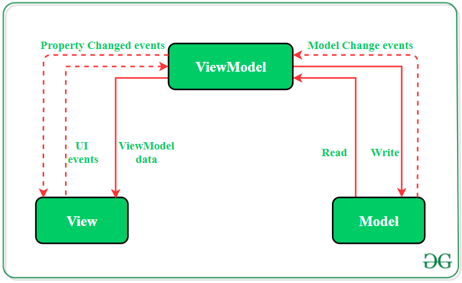
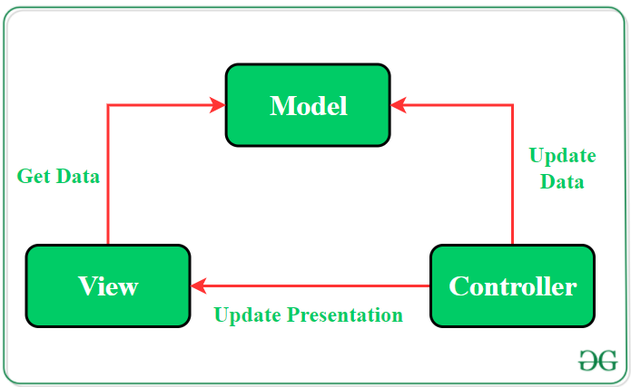

# Android Development

## Table of Contents
1. [Introduction](#introduction)
2. [Android Studio](#android-studio)
3. [Android SDK](#android-sdk)
4. [Android Jetpack](#android-jetpack)
5. [Android Architecture Components](#android-architecture-components)
6. [Android Model-View-ViewModel (MVVM)](#android-model-view-viewmodel-mvvm)
7. [Android Model-View-Controller (MVC)](#android-model-view-controller-mvc)

## Introduction

Android is a mobile operating system developed by Google. It is based on a modified version of the Linux kernel and other open source software, 
and is designed primarily for touchscreen mobile devices such as smartphones and tablets. 
In addition, Google has further developed Android TV for televisions, Android Auto for cars, and Wear OS for wristwatches, each with a specialized user interface. 
Variants of Android are also used on game consoles, digital cameras, PCs and other electronics.

## Android Studio

Android Studio is the official integrated development environment (IDE) for Google's Android operating system,
built on JetBrains' IntelliJ IDEA software and designed specifically for Android development. It is available for download on Windows, macOS and Linux based operating systems.

## Android SDK

The Android software development kit (SDK) includes a comprehensive set of development tools. 
These include a debugger, libraries, a handset emulator based on QEMU, documentation, sample code, and tutorials. 
Currently supported development platforms include computers running Linux (any modern desktop Linux distribution), Mac OS X 10.5.8 or later, and Windows 7 or later.

## Android Jetpack

Android Jetpack is a set of libraries, tools and architectural guidance to help make it quick and easy to build great Android apps. 
It provides common infrastructure code so you can focus on what makes your app unique.

Jetpack comprises the androidx.* Package libraries, unbundled from the platform APIs.

## Android Architecture Components

Android architecture components are a collection of libraries that help you design robust, testable, and maintainable apps. 
Start with classes for managing your UI component lifecycle and handling data to persist, and add ViewModel and LiveData to help build data-driven UIs.

- **Composable Function** (marked by `@Composable`): A composable function is a function that can be used to build a UI. 
  Composable functions are the basic building blocks of a composable UI. 
  They are lightweight and can be used to create complex UIs.
- **State** (ex: `MutableState<String>`): State is data that can change over time. 
  State is stored in a composable function and can be passed to other composable functions.
- **Effect**: An effect is a side effect that can be executed in a composable function. 
  Effects are used to perform tasks such as reading data from a database or making a network request.
- **Compose**: Compose is a modern toolkit for building native Android UI. 
  Compose simplifies and speeds up UI development on Android with a composable, declarative, and reactive programming model.
- **ViewModel**: ViewModel is a class that is used to store and manage UI-related data in a lifecycle-aware way. 
  ViewModel allows data to survive configuration changes such as screen rotations, and it provides access to business logic.
- **LiveData**: LiveData is an observable data holder class. 
  LiveData is used to notify the UI when the underlying data changes. 
  LiveData is lifecycle-aware and only updates the UI when the app is in the foreground.
- **Room**: Room is a persistence library that provides an abstraction layer over SQLite. 
  Room allows you to create a database, define entities, and write queries to access the database.
- **Navigation**: Navigation is a library that helps you implement navigation in your app. 
  Navigation allows you to define navigation paths, navigate between destinations, and pass data between destinations.
- **WorkManager**: WorkManager is a library that allows you to schedule background tasks. 
  WorkManager allows you to run tasks that are deferrable, require guaranteed execution, and are expected to run even if the app is closed.
- **Paging**: Paging is a library that helps you load large data sets in a more efficient way. 
  Paging allows you to load data incrementally and display it in a RecyclerView.
- **DataStore**: DataStore is a library that allows you to store key-value pairs or typed objects. 
  DataStore is a replacement for SharedPreferences and provides type safety and consistency.

## Android Model-View-ViewModel (MVVM)

MVVM is an architectural pattern applied in applications to separate user interface code from data and business logic.
The pattern facilitates the separation of the development of the graphical user interface (the view)
be it via a markup language or GUI code from the development of the business logic or back-end logic.

## Android Model-View-Controller (MVC)

MVC is an architectural pattern that separates an application into three main logical components: the model, the view, and the controller.
Each of these components is built to handle specific development aspects of an application.

## Android Lifecycle

The Android lifecycle is the set of states an activity or fragment can be in during its lifetime.
The lifecycle of an activity or fragment is managed by the Android operating system and is controlled by the user and the system.

- **onCreate()**: Called when the activity is first created.
- **onStart()**: Called when the activity is about to become visible.
- **onResume()**: Called when the activity will start interacting with the user.
- **onPause()**: Called when the activity is going into the background.
- **onStop()**: Called when the activity is no longer visible.
- **onDestroy()**: Called when the activity is being destroyed.
- **onRestart()**: Called when the activity is restarting.