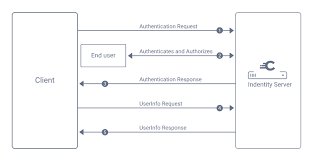

# Representational State Transfer (REST)

## Table of Contents

1. [Introduction](#introduction)
2. [Rest Constraints](#rest-constraints)
3. [Client Request](#client-request)
4. [HTTP Protocol](#http-protocol)
5. [API Concept](#api-concept)
6. [REST API](#rest-api)
7. [OAuth](#oauth)
8. [OpenID Connect](#openid-connect)

## Introduction

REST is an architecture style to develop web services,
which uses the HTTP protocol as a communication interface to transfer data through HTTP methods.
In other words, it allows performing basic data manipulation within an application with efficiency,
such as creating, retrieving, updating and deleting information.

## Rest Constraints

The REST architecture style is based on six constraints:

1. **_Client-Server_**: The main principle of the Client-Server web architecture is the Separation of Concerns, which means that the Client that sends the request it’s completely independent from the Server that returns the response.
2. **_Stateless_**: All the information (state) that is required in a request must be sended by the Client. Therefore, the Server must not store any data during a Client-Server communication, which means that every request is a standalone request.
3. **_Cacheable_**: Cache is a computational storage structure focused on keeping stored data that is frequently accessed, improving performance and network efficiency. Therefore, through caching, it’s possible to reduce or even eliminate the need for the Client to send requests to the Server (who must inform if the request can be cacheable or not).
4. **_Uniform Interface_**: Means how Client and Server will share information by defining an interface that must be followed in every request. In other words, it’s a contract between the Client and the Server that determines the standards for their communication.
    - **_Identification of Resources_**: It’s used in a request to identify what the Client wants to access in the Server. For example, to retrieve a list of `products`, the resource must be setted in the URL: `http://api.example.com/products`
    - **_Manipulation of Resources Through Representations_**: The Client must be sure that the request to the Server has enough information to manipulate (create, retrieve, update, delete) the informed resource, which can be represented by multiple formats, such as JSON, XML, HTML etc. In other words, the Client can specify the desired representation of a resource in every request to a Server. For example, the Client can specify in a request to retrieve a resource in JSON format: `Accept: application/json`
    - **_Self-Descriptive Messages_**: The Server must return a response with enough information to be understood by the Client, which means that the response must contain metadata that describes the data and how to process it. For example, the Server must return a response with the status code `200 OK` if the request was successful.
    - **_Hypermedia as the Engine of Application State (HATEOAS)_**: The Server must return a response with links to other resources that can be accessed by the Client. In other words, the Server must provide a way to navigate through the API by returning links to other resources that can be accessed by the Client. For example, the Server can return a response with links to other resources that can be accessed by the Client: `Link: <http://api.example.com/products?page=2>; rel="next"`
5. **_Layered System_**: A layered system relates to the fact that there can be more components and subsystems between a Client and a Server. In other words, the client can’t assume that it is communicating directly to the Server, and don’t know about the complexity to process the request and return the response. For example, a Client sends a request to a Server, but first it passes by a proxy layer for security check.
6. **_Code on Demand_**: Code On Demand is the only optional constraint, and means that a Server can send an executable code as a response to the Client. In other words, it’s what happens when a browser, for example, receives a response from the Server with a HTML tag `<script>` so, when the HTML document is loaded, the script can be executed.

## Client Request

The Client Request has four main elements that compose all the information that is necessary 
to interact with the Server:

1. **_HTTP Method_**: The HTTP Method is the action that the Client wants to perform in the Server, and it’s defined by the HTTP protocol. The most common methods are:
    - **_GET_**: Retrieve information about the REST API's resources.
    - **_POST_**: Create a new resource.
    - **_PUT_**: Update a resource.
    - **_DELETE_**: Remove a resource.
    - **_PATCH_**: Update partial resources.
    - **_HEAD_**: Retrieve headers only.
    - **_OPTIONS_**: Retrieve the supported operations in the REST API.
    - **_TRACE_**: Retrieve the path of the request.
    - **_CONNECT_**: Convert the request connection to a transparent TCP/IP tunnel.
2. **_URL_**: URL means Uniform Resource Locator, which is the address to not just identify a resource, but also to specify how to access it. For example: `http://api.example.com`
3. **_Resource URI_**: URI means Uniform Resource Identifier, which is used in the URL to specify which resource the Client would like to access in a request. For example: `http://api.example.com/products`
4. **_Parameters_**: Parameters are used in the URL to specify additional information that the Client would like to send in a request. For example: `http://api.example.com/products?category=electronics`
5. **_Body Params_**: it’s the body of the request which contains all the data that the Server needs to successfully process the request. For example: `{"name": "Product 1", "price": 100.00}` in JSON format.
6. **_Route Params_**: it’s used to identify a specific resource in the URL. For example: `http://api.example.com/products/1` where `1` is the route param.
7. **_Headers_**: Headers are used in the request to specify additional information that the Client would like to send to the Server. For example: `Accept: application/json` to specify that the Client would like to receive the response in JSON format or `Authorization: Bearer token` to attach the token which is necessary to get access to the resource.

## HTTP Protocol

HTTP stands for HyperText Transfer Protocol. It is the main way web browsers and servers communicate to share information on the internet.
The HTTP protocol is based on a request-response model, which means that a Client sends a request to a Server, and the Server returns a response to the Client.
The HTTP Protocol determines not just the methods that are allowed in a REST API, which means 
the action types that the Client can demand in a request, but also 
the status codes that the Server returns as a response to have a good communication flow.

The most common HTTP methods are:

1. **_GET_**: Retrieve information about the REST API's resources.
2. **_POST_**: Create a new resource.
3. **_PUT_**: Update a resource.
4. **_DELETE_**: Remove a resource.
5. **_PATCH_**: Update partial resources.

The most common HTTP status codes are:

1. **_200 OK_**: The request has succeeded.
2. **_201 Created_**: The request has been fulfilled and has resulted in one or more new resources being created.
3. **_204 No Content_**: The server successfully processed the request and is not returning any content.
4. **_301 Moved Permanently_**: The requested resource has been assigned a new permanent URI and any future references to this resource should be done using one of the returned URIs.
5. **_400 Bad Request_**: The server could not understand the request due to invalid syntax.
6. **_401 Unauthorized_**: The client must authenticate itself to get the requested response.
7. **_403 Forbidden_**: The client does not have access rights to the content.
8. **_404 Not Found_**: The server cannot find the requested resource.
9. **_405 Method Not Allowed_**: The method specified in the request is not allowed.
10. **_500 Internal Server Error_**: The server has encountered a situation it doesn't know how to handle.
11. **_503 Service Unavailable_**: The server is not ready to handle the request.

## API Concept

API means Application Programming Interface and, like any other interface, allows interactions.
In the case of an API, it allows interactions between systems by following a set of standards
and protocols to share features, information and data.
In other words, it provides developers the opportunity to build and design products and 
services that will communicate with other products and services.

## REST API

The REST API, or Representational State Transfer Application Programming Interface, 
is a mechanism for accessing online services using HTTP requests to obtain, change, and remove data. 
It depends on the REST architectural style, which is differentiated by its capacity 
to send resource representations between systems while retaining no server context between requests.

An API allows software programs to exchange data. 
It is a necessary part of modern software paradigms such as **microservices** systems.

### Security

APIs are accessed by clients, which can be web applications, mobile applications, or other services.
Therefore, it is essential to secure APIs to prevent unauthorized access and protect sensitive data.
API security is the process of protecting APIs against attacks. 
APIs are becoming a popular target for attackers due to their widespread use and 
access to necessary program functionality and data.
The following are the most common security mechanisms used to secure APIs:

1. **_Authentication_**: Authentication is the process of verifying the identity of a user or system.
2. **_Authorization_**: Authorization is the process of determining what a user or system can access.
3. **_Secure Communication_**: Protect the communication channel using **HTTPS/SSL/TLS** to encrypt data in transit.
4. **_Data Validation and Sanitization_**: Validate and sanitize all input data and parameters to prevent injection attacks, such as SQL injection or cross-site scripting (XSS).
5. **_Rate Limiting_**: Limit the number of requests a client can make to prevent abuse.
6. **_Logging and Monitoring_**: Log and monitor API requests and responses to track usage and detect anomalies.
7. **_Error Handling_**: Provide meaningful error messages to help developers debug issues and prevent information disclosure.
8. **_Secure Storage of Credentials and Secrets_**: Safely store and manage credentials and API keys by using secure credential management systems, such as key vaults or encrypted databases. Avoid hard-coding credentials within the codebase to prevent accidental exposure.
9. **_Implementing Role-Based Access Control (RBAC)_**: Implement role-based access control to restrict access to resources based on user roles and permissions.
10. **_Implementing Two-Factor Authentication (2FA)_**: Implement two-factor authentication to add an extra layer of security to the authentication process.
11. **_Versioning_**: Use versioning to manage changes to the API and ensure backward compatibility with existing clients.

### API Authentication

API Authentication is the process of verifying the identity of a user or device before allowing 
them to access to an APIs protected resources. 
Authentication is used to ensure that only authorized users can access the API and 
to prevent unauthorized access.

There are several methods for API authentication, including:

1. **_Basic Authentication_**: Basic authentication is a simple authentication scheme built into the HTTP protocol. 
   It involves sending a base64-encoded username and password in the Authorization header of the request.
2. **_Token-Based Authentication_**: Token-based authentication involves sending a token in the Authorization header of the request. 
   The token is typically generated by the server and is used to authenticate the user for subsequent requests.
3. **_OAuth_**: OAuth is an open standard for access delegation that is commonly used for API authentication. 
   It involves getting an access token from an authorization server and using that token to access protected resources.
4. **_API Keys_**: API keys are unique identifiers that are used to authenticate requests to an API. 
   They are typically passed in the request headers or query parameters.

### API Authorization

API Authorization is the process of determining what a user or system can access.

There are several methods for API authorization, including:

1. **_Role-Based Access Control (RBAC)_**: Role-based access control is a method of restricting access to resources based on the roles assigned to users. 
   Users are assigned roles, and each role has specific permissions that determine what resources the user can access.
2. **_Attribute-Based Access Control (ABAC)_**: Attribute-based access control is a method of restricting access to resources based on the attributes of the user, 
   the resource, and the environment. 
   Access decisions are made based on policies that define the conditions under which access is granted.

### Rest API Attacks

APIs are becoming a popular target for attackers due to their widespread use and access to necessary program functionality and data.
The following are the most common types of attacks on APIs:

1. **_Cross-Site Scripting (XSS)_**: XSS attacks involve injecting malicious scripts into web pages viewed by other users.
2. **_SQL Injection_**: SQL injection attacks involve inserting malicious SQL code into input fields to manipulate the database.
3. **_Cross-Site Request Forgery (CSRF)_**: CSRF attacks involve tricking users into performing actions on a website without their

## OAuth

OAuth stands for Open Authorization and is an open standard for access delegation, commonly used for API authentication.
OAuth allows a user to grant a third-party application access to their resources without sharing their credentials.
OAuth is commonly used by social media platforms, such as Facebook, Twitter, and Google, to allow users to log in to third-party applications using their social media accounts.

OAuth defines four roles:

1. **_Resource Owner_**: The resource owner is the user who authorizes an application to access their account. The application’s access to the user’s account is limited to the scope of the authorization granted (e.g. read or write access).
2. **_Client_**: The client is the application that wants to access the user’s account. Before it may do so, it must be authorized by the user, and the authorization must be validated by the API.
3. **_Resource Server_**: The resource server hosts the protected user accounts. It is capable of accepting and responding to protected resource requests using access tokens.
4. **_Authorization Server_**: The authorization server verifies the identity of the user then issues access tokens to the application.

OAuth defines several grant types for different use cases:

1. **_Authorization Code Grant_**: Used by web applications that are running on a server. This is the most secure OAuth flow.
2. **_Implicit Grant_**: Used by applications that are executing on the user’s device. This flow is less secure than the authorization code grant.
3. **_Resource Owner Password Credentials Grant_**: Used by applications that are highly trusted. This flow requires the user to provide their username and password.
4. **_Client Credentials Grant_**: Used by applications that are accessing their resources. This flow is used when the client application is the resource owner.

## OpenID Connect

OpenID Connect is an identity layer built on top of OAuth 2.0. It allows clients to verify the identity of the end-user based on the authentication performed by an authorization server.
OpenID Connect provides a standard way for clients to verify the identity of the end-user and to obtain basic profile information about the end-user.

OpenID Connect defines several roles:

1. **_Relying Party (RP)_**: The relying party is the client application that wants to verify the identity of the end-user.
2. **_Identity Provider (IdP)_**: The identity provider is the authorization server that authenticates the end-user and provides identity information to the client application.
3. **_End-User_**: The end-user is the person who is trying to access the client application.
4. **_User Agent_**: The user agent is the browser or application that the end-user is using to access the client application.
5. **_UserInfo Endpoint_**: The UserInfo endpoint is an API that the client application can use to obtain basic profile information about the end-user.
6. **_ID Token_**: The ID token is a JSON Web Token (JWT) that contains identity information about the end-user.
7. **_Access Token_**: The access token is a token that the client application can use to access protected resources on behalf of the end-user.
8. **_Authorization Code_**: The authorization code is a short-lived token that the client application can exchange for an access token and ID token.

OpenID Connect defines several flows for different use cases:

1. **_Authorization Code Flow_**: Used by web applications that are running on a server. This is the most secure OpenID Connect flow.
2. **_Implicit Flow_**: Used by applications that are executing on the user’s device. This flow is less secure than the authorization code flow.
3. **_Hybrid Flow_**: Combines elements of the authorization code flow and the implicit flow. This flow is used when the client application needs both an ID token and an access token.

